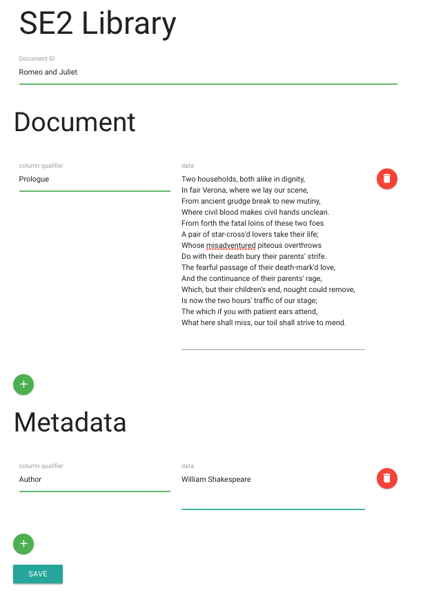

<!--
*** Thanks for checking out the my README-Template. If you have a suggestion
*** that would make this better, please fork the repo and create a pull request
*** or simply open an issue with the tag "enhancement".
*** Thanks again! Now go create something AMAZING! :D
-->


<!-- PROJECT READY MADE -->
<!--
*** I'm using markdown "reference style" links for readability.
*** Reference links are enclosed in brackets [ ] instead of parentheses ( ).
*** See the bottom of this document for the declaration of the reference variables
*** for contributors-url, forks-url, etc. This is an optional, concise syntax you may use.
*** https://www.markdownguide.org/basic-syntax/#reference-style-links
-->


---
## Table of Contents

- [Table of Contents](#table-of-contents)
- [Online document library <a name = "about_the_project"></a>](#online-document-library-)
- [Installation <a name = "installation"></a>](#installation-)
- [Development Setup <a name = "development_setup"></a>](#development-setup-)
- [Directory Structure <a name = "directory_structure"></a>](#directory-structure-)
- [Contact <a name = "contact"></a>](#contact-)
- [References <a name = "references"></a>](#references-)


<!-- ABOUT THE PROJECT -->
## Online document library <a name = "about_the_project"></a>

[Online document library](https://github.com/shakil18/Online-document-library "Git repository") is an implementation of reverse proxy using Nginx in Golang and maintaining  an online document library in HBase @TU Dresden. 

For more details please check this [document](./docu/README.rst).

|  Input Form   |  Output |
| ------- | ------- |
|    |    |

> System Architecture:
> 


<!-- INSTALLATION -->
## Installation <a name = "installation"></a>

- Install [Docker](https://docs.docker.com/engine/install/ubuntu/) & [Docker-Compose](https://docs.docker.com/compose/install/).


<!-- DEVELOPMENT -->
## Development Setup <a name = "development_setup"></a>

- open the terminal and change terminal directory to the "Online-document-library" repo. 
- Then run docker-compose up to run the system.

```shell
$ cd ../Online-document-library
$ docker-compose up
```


<!-- DIRECTORY STRUCTURE -->
## Directory Structure <a name = "directory_structure"></a>

Here's a project's directory structure:

```text
Online-document-library
├── grproxy        # Grproxy Dockerfile, Makefile and configuration
├── gserve         # Gserve Dockerfile, Makefile and configuration
├── hbase          # Hbase Dockerfile, Makefile and configuration
├── image          # Architecture, Input & Output form 
├── nginx          # Nginx Dockerfile and configuration  
├── docu           # Documentation of task 
└── ...

```


<!-- CONTACT -->
## Contact <a name = "contact"></a>

**Azizul Hakim Shakil** - [@ShakilAzizul](https://twitter.com/ShakilAzizul) - azizulhakim.shakil18@gmail.com

Project Link: [https://github.com/shakil18/Online-document-library](https://github.com/shakil18/Online-document-library)


<!-- REFERENCES -->
## References <a name = "references"></a>
* [Docker Docs](<https://docs.docker.com/>)
* [Docker Compose file reference](<https://docs.docker.com/compose/compose-file/>)
* [Apache HBase Reference Guide](<http://hbase.apache.org/book.html>)
* [ZooKeeper Documentation](<http://zookeeper.apache.org/doc/trunk/>)
* [Go Documentation](<https://golang.org/doc/>)
* [Pro Git](<https://git-scm.com/book/en/v2>)

